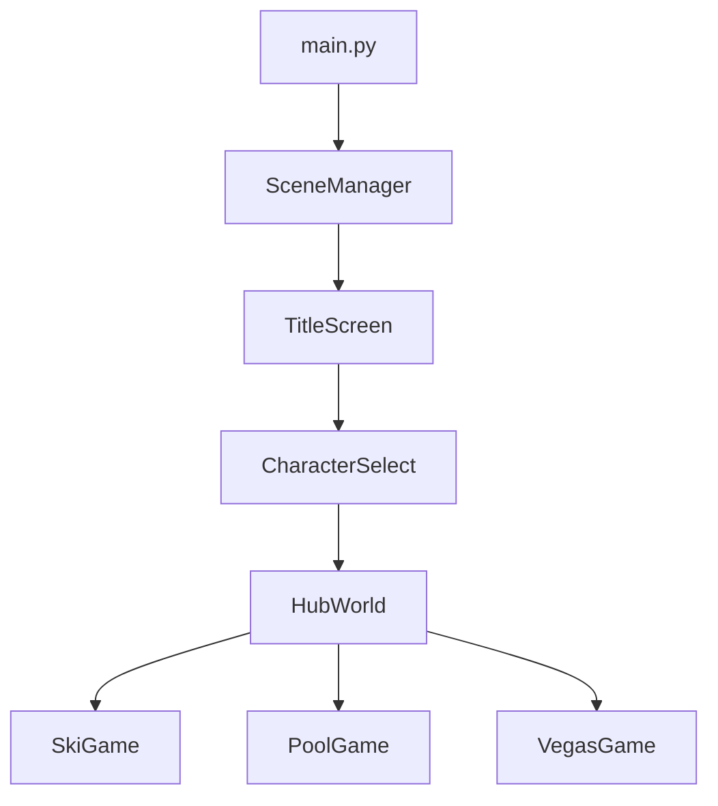

# CLAUDE.md - Danger Rose Game Development

This file provides comprehensive guidance to Claude Code (claude.ai/code) for developing the Danger Rose family game project.

## 🎮 Project Overview

**Danger Rose** is a family-friendly Pygame project designed for collaborative development between parents and kids. Players control family members (Danger, Rose, and Dad) through a cozy apartment hub world and three exciting minigames.

### Current Status
- ✅ Title screen with character selection
- ✅ Animation system for sprites
- ✅ Scene management foundation
- 🚧 Hub world implementation (next priority)
- 📋 20 GitHub issues created for MVP features

## 🚀 Quick Commands

### Game Development
```bash
# Run the game
make run                    # or: poetry run python src/main.py

# Run in debug mode
make debug                  # Shows FPS, debug info

# Run specific minigame
make run-ski               # Direct to ski game
make run-pool              # Direct to pool game
make run-vegas             # Direct to vegas game

# Kid-friendly mode
make kids                  # Simplified errors, visual feedback
```

### Testing & Quality
```bash
# Run tests
make test                  # All tests
make test-fast            # Fast tests only
make test-visual          # Visual regression tests
make coverage             # Generate coverage report

# Code quality
make lint                 # Check code style
make format               # Auto-format code
make check                # Run all checks
```

### Custom AI Commands
```bash
# Sprite work
/sprite-cut assets/images/characters/danger.png 256 341
/generate-placeholder character boss_sprite 256 256
/validate-sprites --fix

# Game development
/create-scene bonus_game minigame
/test-minigame ski
/balance-game pool normal

# Kid-friendly
/explain-to-kid src/scenes/ski.py 8
/kid-challenge easy variables

# Performance
/optimize-fps ski 60
/profile-memory
```

## 🏗️ Architecture

### Scene Management Flow


### Key Systems
1. **SceneManager** (`src/scene_manager.py`)
   - Manages scene transitions
   - Stores game state
   - Handles scene lifecycle

2. **Base Scene Class**
   ```python
   class Scene(ABC):
       def handle_event(event) -> Optional[str]
       def update(dt: float) -> None
       def draw(screen: Surface) -> None
       def on_enter(previous_scene, data) -> None
       def on_exit() -> Dict[str, Any]
   ```

3. **Animation System** (`src/utils/attack_character.py`)
   - Sprite sheet loading (1024x1024)
   - Frame extraction (256x341 per frame)
   - State-based animations

4. **Asset Management** (`src/utils/sprite_loader.py`)
   - Automatic placeholders for missing assets
   - Centralized path resolution
   - Performance optimization

## 🎨 Asset Specifications

### Sprite Sheets
```yaml
Format: PNG with transparency
Full Sheet: 1024x1024 pixels
Grid Layout: 3 rows x 4 columns
Frame Size: 256x341 pixels
Display Size: 128x128 (scaled in-game)
```

### Required Animations
- **Idle**: 4 frames
- **Walk**: 8 frames
- **Jump**: 3 frames
- **Attack**: 6 frames
- **Hurt**: 2 frames
- **Victory**: 8 frames

## 🧪 Testing Strategy

### Test Categories
1. **Unit Tests**: Core logic, isolated components
2. **Integration Tests**: Scene transitions, save/load
3. **Visual Tests**: Sprite rendering, animations
4. **Performance Tests**: FPS, memory usage

### Writing Game Tests
```python
# Example game test
def test_player_collision():
    """Test that player collides with obstacles correctly"""
    player = Player(x=100, y=100)
    obstacle = Tree(x=100, y=100)

    assert player.check_collision(obstacle) == True
    assert player.lives == 2  # Lost one life
```

## 🛠️ Development Workflow

### Starting a New Feature
1. **Pick an Issue**: Check GitHub issues by priority
2. **Create Branch**: `git checkout -b feat/issue-N-description`
3. **Use AI Agents**: `/sprite-expert` for sprites, `/game-mechanics` for gameplay
4. **Test First**: Write tests before implementation
5. **Check Quality**: `make check` before committing

### Common Tasks

#### Adding a New Scene
```bash
/create-scene bonus_level minigame
# This creates:
# - src/scenes/bonus_level.py
# - tests/test_bonus_level.py
# - Updates scene registry
```

#### Working with Sprites
```bash
# Validate all sprites
/validate-sprites

# Cut sprite sheet
/sprite-cut path/to/sheet.png 256 341

# Generate placeholder
/generate-placeholder character enemy_boss 128 128
```

#### Performance Optimization
```bash
# Profile current scene
/optimize-fps

# Check memory usage
/profile-memory

# Run performance tests
make profile
```

## 👶 Kid-Friendly Development

### Explaining Code to Kids
```bash
# Explain a file
/explain-to-kid src/player.py 10

# Create a challenge
/kid-challenge easy loops
```

### Kid-Friendly Features
- **Simple Errors**: Clear, non-technical error messages
- **Visual Feedback**: Animations for all actions
- **Learning Comments**: Explanatory comments in code
- **Fun Commands**: `/celebrate` for achievements!

## 🎯 Current Priorities

### High Priority (MVP)
1. **Hub World** (#12-16): Basic navigation and doors
2. **Ski Minigame** (#17-21): Core skiing mechanics
3. **Save System** (#22): Progress persistence
4. **Sound Manager** (#23): Music and SFX

### Medium Priority
1. **Pool Minigame** (#26-29): Target shooting fun
2. **Vegas Minigame** (#30-31): Side-scrolling adventure
3. **Pause Menu** (#24): In-game menu system
4. **High Scores** (#25): Leaderboard tracking

## 📋 Issue Guidelines

### Working on Issues
1. **Assign Yourself**: Comment on the issue
2. **Ask Questions**: Clarify requirements
3. **Update Progress**: Regular status updates
4. **Link PR**: Reference issue in PR

### Creating New Issues
- Use templates in `.github/ISSUE_TEMPLATE/`
- Add clear acceptance criteria
- Tag appropriately (enhancement, bug, etc.)
- Set realistic priorities

## 🔧 Debugging Tips

### Common Issues
1. **Missing Assets**: Check placeholders are generating
2. **Scene Transitions**: Verify scene names in registry
3. **Animation Glitches**: Check frame counts and timing
4. **Performance**: Use debug mode to show FPS

### Debug Commands
```bash
# Enable all debug output
DEBUG=true make run

# Profile specific system
PROFILE_SYSTEM=animation make run

# Memory debugging
MEMORY_DEBUG=true make run
```

## 🚀 Build & Release

### Building Executables
```bash
# Single platform
make build

# All platforms
make build-all

# Prepare release
make release
```

### Release Checklist
- [ ] All tests passing
- [ ] Assets validated
- [ ] Version bumped
- [ ] Changelog updated
- [ ] Screenshots captured

## 🎮 Game-Specific Patterns

### Movement Code
```python
# Smooth movement with kid-friendly variable names
player_speed = 5.0  # How fast the player moves
player.x += player_speed * direction  # Move in direction
```

### Collision Detection
```python
# Simple rectangle collision
def hits_obstacle(player, obstacle):
    """Check if player bumped into something"""
    return player.rect.colliderect(obstacle.rect)
```

### Score System
```python
# Clear scoring with visual feedback
def collect_item(player, item):
    """Player collected something good!"""
    player.score += item.points
    show_sparkles(item.position)
    play_sound("collect.ogg")
```

---

**Remember**: This is a family project! Keep code simple, add helpful comments, and make it fun for kids to understand and modify. Every feature should bring joy to players and developers alike! 🎮✨
