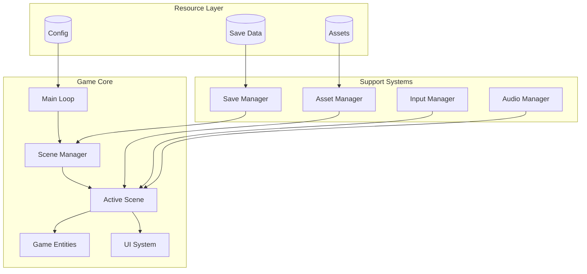
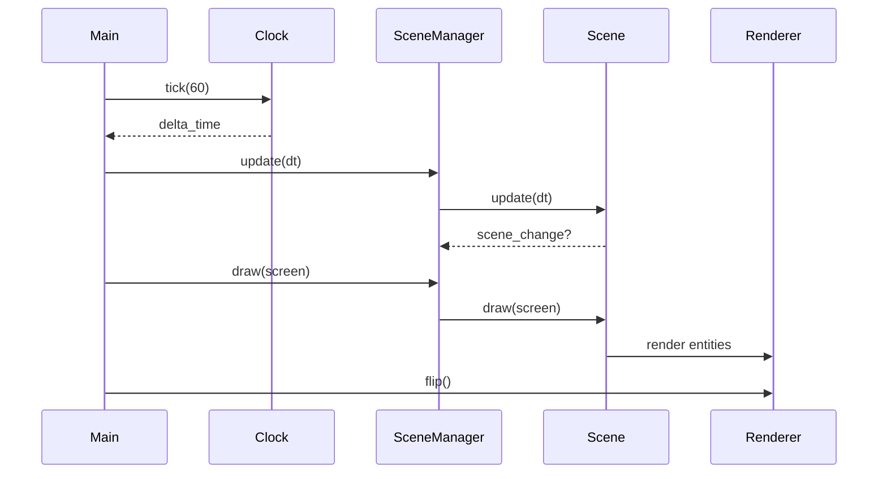
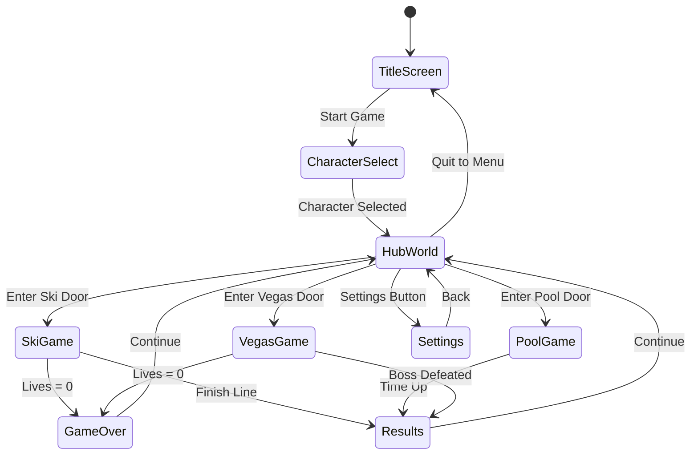
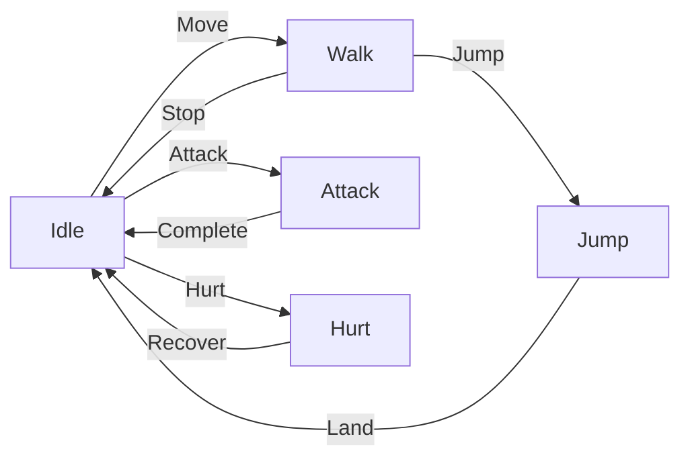
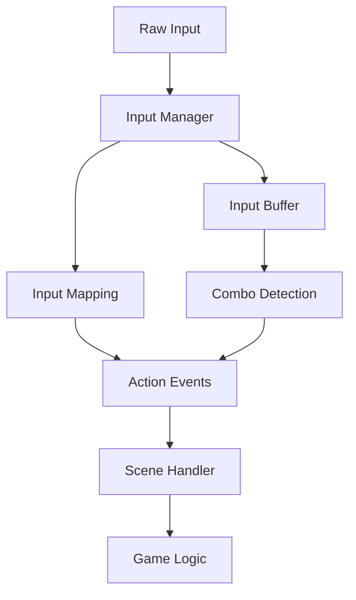
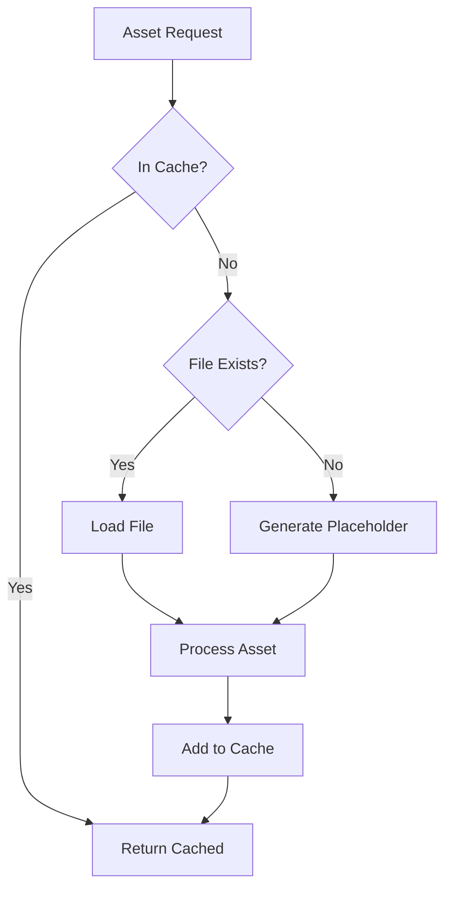
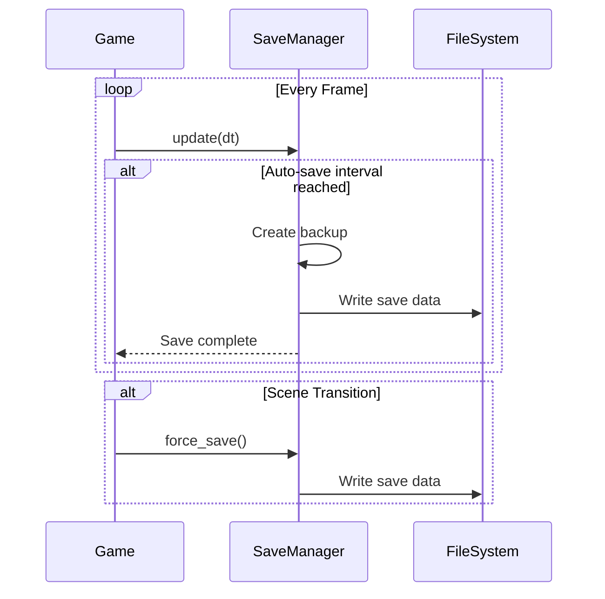
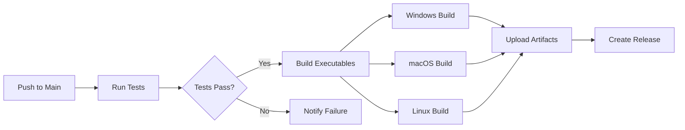

# 🏗️ Danger Rose - Technical Architecture

## Table of Contents
1. [System Overview](#system-overview)
2. [Architecture Patterns](#architecture-patterns)
3. [Core Systems](#core-systems)
4. [Scene Management](#scene-management)
5. [Animation System](#animation-system)
6. [Input Handling](#input-handling)
7. [Asset Pipeline](#asset-pipeline)
8. [Save System](#save-system)
9. [Performance Optimization](#performance-optimization)
10. [Build & Deployment](#build--deployment)

## System Overview

### High-Level Architecture


### Technology Stack
```yaml
Core:
  - Language: Python 3.12+
  - Framework: Pygame-CE 2.4+
  - Package Manager: Poetry

Development:
  - Testing: pytest 7.4+
  - Linting: Ruff
  - Formatting: Black
  - Type Checking: mypy

Build:
  - Executable: PyInstaller 6.0+
  - Automation: GitHub Actions
  - Platform Targets: Windows, macOS, Linux
```

## Architecture Patterns

### Scene-Based Architecture
The game uses a scene-based architecture where each major game state is encapsulated in a Scene class:

```python
from abc import ABC, abstractmethod
from typing import Optional, Dict, Any
import pygame

class Scene(ABC):
    """Base class for all game scenes"""

    def __init__(self, screen_width: int, screen_height: int):
        self.screen_width = screen_width
        self.screen_height = screen_height
        self.next_scene: Optional[str] = None
        self.scene_data: Dict[str, Any] = {}

    @abstractmethod
    def handle_event(self, event: pygame.event.Event) -> Optional[str]:
        """Process input events, return next scene name if transitioning"""
        pass

    @abstractmethod
    def update(self, dt: float) -> None:
        """Update scene logic with delta time"""
        pass

    @abstractmethod
    def draw(self, screen: pygame.Surface) -> None:
        """Render scene to screen"""
        pass

    def on_enter(self, previous_scene: Optional[str], data: Dict[str, Any]) -> None:
        """Called when scene becomes active"""
        pass

    def on_exit(self) -> Dict[str, Any]:
        """Called when scene is about to change"""
        return self.scene_data
```

### Entity-Component Pattern
Game objects use a simplified entity-component pattern:

```python
class Entity:
    """Base game entity with component-like features"""

    def __init__(self, x: float, y: float):
        self.transform = Transform(x, y)
        self.sprite = None
        self.collider = None
        self.components = []

    def add_component(self, component):
        self.components.append(component)
        component.entity = self

    def update(self, dt: float):
        for component in self.components:
            component.update(dt)

    def draw(self, screen: pygame.Surface):
        if self.sprite:
            self.sprite.draw(screen, self.transform.position)
```

## Core Systems

### Game Loop Architecture


### System Communication
```python
# Event-driven communication between systems
class EventBus:
    """Central event system for decoupled communication"""

    def __init__(self):
        self._listeners = defaultdict(list)

    def subscribe(self, event_type: str, callback: Callable):
        self._listeners[event_type].append(callback)

    def publish(self, event_type: str, data: Any = None):
        for callback in self._listeners[event_type]:
            callback(data)

# Usage example
event_bus = EventBus()
event_bus.subscribe("player_scored", self.on_player_scored)
event_bus.publish("player_scored", {"points": 100, "player": "Danger"})
```

## Scene Management

### Scene State Machine


### Scene Transition System
```python
class SceneManager:
    """Manages scene transitions and game state"""

    def __init__(self):
        self.scenes: Dict[str, Scene] = {}
        self.current_scene: Optional[Scene] = None
        self.transition_data: Dict[str, Any] = {}

    def register_scene(self, name: str, scene: Scene):
        self.scenes[name] = scene

    def transition_to(self, scene_name: str, data: Dict[str, Any] = None):
        # Fade out effect
        self.fade_out()

        # Exit current scene
        if self.current_scene:
            self.transition_data = self.current_scene.on_exit()

        # Enter new scene
        previous = self.current_scene.__class__.__name__ if self.current_scene else None
        self.current_scene = self.scenes[scene_name]
        self.current_scene.on_enter(previous, data or self.transition_data)

        # Fade in effect
        self.fade_in()
```

## Animation System

### Sprite Sheet Management
```python
class SpriteSheet:
    """Handles sprite sheet loading and frame extraction"""

    def __init__(self, path: str, frame_width: int, frame_height: int):
        self.sheet = pygame.image.load(path)
        self.frame_width = frame_width
        self.frame_height = frame_height
        self.frames = self._extract_frames()

    def _extract_frames(self) -> List[pygame.Surface]:
        frames = []
        sheet_width = self.sheet.get_width()
        sheet_height = self.sheet.get_height()

        for y in range(0, sheet_height, self.frame_height):
            for x in range(0, sheet_width, self.frame_width):
                frame = self.sheet.subsurface(
                    pygame.Rect(x, y, self.frame_width, self.frame_height)
                )
                frames.append(frame)

        return frames
```

### Animation State Machine


### Animation Controller
```python
class AnimationController:
    """Manages character animation states and transitions"""

    def __init__(self):
        self.animations: Dict[str, Animation] = {}
        self.current_animation = "idle"
        self.transition_rules = {
            "idle": ["walk", "jump", "attack", "hurt"],
            "walk": ["idle", "jump", "attack", "hurt"],
            "jump": ["idle", "hurt"],
            "attack": ["idle"],
            "hurt": ["idle"]
        }

    def can_transition(self, from_state: str, to_state: str) -> bool:
        return to_state in self.transition_rules.get(from_state, [])

    def transition_to(self, state: str):
        if self.can_transition(self.current_animation, state):
            self.current_animation = state
            self.animations[state].reset()
```

## Input Handling

### Input Architecture


### Input Manager Implementation
```python
class InputManager:
    """Centralized input handling with action mapping"""

    def __init__(self):
        self.key_map = {
            "move_left": [pygame.K_LEFT, pygame.K_a],
            "move_right": [pygame.K_RIGHT, pygame.K_d],
            "jump": [pygame.K_SPACE, pygame.K_w],
            "attack": [pygame.K_z, pygame.K_j],
            "interact": [pygame.K_RETURN, pygame.K_e]
        }
        self.gamepad_map = {
            "move_left": [0, -1],  # D-pad left
            "move_right": [0, 1],   # D-pad right
            "jump": 0,              # A button
            "attack": 1,            # B button
        }
        self.actions = set()

    def update(self):
        self.actions.clear()
        keys = pygame.key.get_pressed()

        # Keyboard input
        for action, keys_list in self.key_map.items():
            if any(keys[k] for k in keys_list):
                self.actions.add(action)

        # Gamepad input (if connected)
        if pygame.joystick.get_count() > 0:
            joy = pygame.joystick.Joystick(0)
            # Process gamepad inputs

    def is_action_pressed(self, action: str) -> bool:
        return action in self.actions
```

### Multi-Player Input
```python
class MultiplayerInputManager:
    """Handles input for multiple local players"""

    def __init__(self, max_players: int = 3):
        self.players = []
        self.keyboard_player = PlayerInput(0, "keyboard")
        self.players.append(self.keyboard_player)

        # Add gamepad players
        for i in range(pygame.joystick.get_count()):
            if len(self.players) < max_players:
                self.players.append(PlayerInput(i + 1, f"gamepad_{i}"))

    def get_player_input(self, player_id: int) -> Dict[str, bool]:
        if player_id < len(self.players):
            return self.players[player_id].get_actions()
        return {}
```

## Asset Pipeline

### Asset Loading System


### Asset Manager
```python
class AssetManager:
    """Centralized asset loading with caching and fallbacks"""

    def __init__(self):
        self._image_cache: Dict[str, pygame.Surface] = {}
        self._sound_cache: Dict[str, pygame.mixer.Sound] = {}
        self._music_cache: Dict[str, str] = {}
        self.placeholder_color = (255, 0, 255)  # Magenta

    def load_image(self, path: str, fallback_size: Tuple[int, int] = (64, 64)) -> pygame.Surface:
        if path in self._image_cache:
            return self._image_cache[path]

        try:
            image = pygame.image.load(path).convert_alpha()
            self._image_cache[path] = image
            return image
        except (FileNotFoundError, pygame.error):
            # Generate placeholder
            placeholder = pygame.Surface(fallback_size)
            placeholder.fill(self.placeholder_color)

            # Add path text
            font = pygame.font.Font(None, 12)
            text = font.render(os.path.basename(path), True, (255, 255, 255))
            text_rect = text.get_rect(center=(fallback_size[0]//2, fallback_size[1]//2))
            placeholder.blit(text, text_rect)

            self._image_cache[path] = placeholder
            return placeholder
```

### Resource Optimization
```python
class ResourceOptimizer:
    """Optimizes assets for performance"""

    @staticmethod
    def optimize_surface(surface: pygame.Surface) -> pygame.Surface:
        """Convert surface to optimal format"""
        if surface.get_alpha():
            return surface.convert_alpha()
        return surface.convert()

    @staticmethod
    def create_mipmap_chain(surface: pygame.Surface, levels: int = 4) -> List[pygame.Surface]:
        """Generate mipmaps for distant rendering"""
        mipmaps = [surface]
        current = surface

        for _ in range(levels - 1):
            width = max(1, current.get_width() // 2)
            height = max(1, current.get_height() // 2)
            mipmap = pygame.transform.smoothscale(current, (width, height))
            mipmaps.append(mipmap)
            current = mipmap

        return mipmaps
```

## Save System

### Save Data Structure
```python
@dataclass
class SaveData:
    """Game save data structure"""

    # Player progress
    selected_character: str = "Danger"
    unlocked_characters: List[str] = field(default_factory=lambda: ["Danger", "Rose"])

    # High scores
    high_scores: Dict[str, Dict[str, int]] = field(default_factory=dict)

    # Unlockables
    unlocked_decorations: List[str] = field(default_factory=list)
    unlocked_palettes: Dict[str, List[str]] = field(default_factory=dict)

    # Statistics
    total_playtime: float = 0.0
    games_played: Dict[str, int] = field(default_factory=dict)

    # Settings
    master_volume: float = 1.0
    sfx_volume: float = 1.0
    music_volume: float = 1.0
    fullscreen: bool = False
```

### Save Manager Implementation
```python
class SaveManager:
    """Handles game save/load operations"""

    def __init__(self, save_path: str = "saves/game_save.json"):
        self.save_path = save_path
        self.save_data = SaveData()
        self.auto_save_interval = 60.0  # seconds
        self.last_save_time = 0.0

    def save(self) -> bool:
        """Save game data to file"""
        try:
            os.makedirs(os.path.dirname(self.save_path), exist_ok=True)

            save_dict = asdict(self.save_data)
            save_dict["version"] = "1.0.0"
            save_dict["timestamp"] = datetime.now().isoformat()

            with open(self.save_path, 'w') as f:
                json.dump(save_dict, f, indent=2)

            return True
        except Exception as e:
            print(f"Save failed: {e}")
            return False

    def load(self) -> bool:
        """Load game data from file"""
        try:
            if not os.path.exists(self.save_path):
                return False

            with open(self.save_path, 'r') as f:
                save_dict = json.load(f)

            # Version compatibility check
            if save_dict.get("version") != "1.0.0":
                self.migrate_save(save_dict)

            # Remove metadata before loading
            save_dict.pop("version", None)
            save_dict.pop("timestamp", None)

            self.save_data = SaveData(**save_dict)
            return True
        except Exception as e:
            print(f"Load failed: {e}")
            return False
```

### Auto-Save System


## Performance Optimization

### Rendering Optimization
```python
class RenderOptimizer:
    """Optimizes rendering performance"""

    def __init__(self):
        self.dirty_rects: List[pygame.Rect] = []
        self.use_dirty_rects = True

    def add_dirty_rect(self, rect: pygame.Rect):
        """Mark area for redraw"""
        if self.use_dirty_rects:
            self.dirty_rects.append(rect)

    def optimize_render(self, screen: pygame.Surface, background: pygame.Surface):
        """Render only changed areas"""
        if self.use_dirty_rects and self.dirty_rects:
            # Clear dirty areas
            for rect in self.dirty_rects:
                screen.blit(background, rect, rect)

            # Return rects for targeted drawing
            rects = self.dirty_rects.copy()
            self.dirty_rects.clear()
            return rects
        else:
            # Full screen clear
            screen.blit(background, (0, 0))
            return [screen.get_rect()]
```

### Memory Management
```python
class MemoryManager:
    """Manages memory usage and garbage collection"""

    def __init__(self, max_cache_size_mb: int = 100):
        self.max_cache_size = max_cache_size_mb * 1024 * 1024
        self.current_usage = 0
        self.cache_items: List[Tuple[float, str, Any]] = []

    def add_to_cache(self, key: str, item: Any, size_bytes: int):
        """Add item to cache with LRU eviction"""
        self.current_usage += size_bytes
        self.cache_items.append((time.time(), key, item))

        # Evict old items if over limit
        while self.current_usage > self.max_cache_size:
            if not self.cache_items:
                break

            _, evict_key, evict_item = self.cache_items.pop(0)
            item_size = self.estimate_size(evict_item)
            self.current_usage -= item_size

    @staticmethod
    def estimate_size(obj: Any) -> int:
        """Estimate memory size of object"""
        if isinstance(obj, pygame.Surface):
            return obj.get_width() * obj.get_height() * 4  # RGBA
        return sys.getsizeof(obj)
```

### Performance Profiling
```python
class PerformanceProfiler:
    """Profile game performance"""

    def __init__(self):
        self.frame_times: deque = deque(maxlen=60)
        self.system_times: Dict[str, deque] = defaultdict(lambda: deque(maxlen=60))

    @contextmanager
    def profile(self, system_name: str):
        """Profile a system's execution time"""
        start = time.perf_counter()
        yield
        elapsed = time.perf_counter() - start
        self.system_times[system_name].append(elapsed * 1000)  # Convert to ms

    def get_stats(self) -> Dict[str, float]:
        """Get performance statistics"""
        stats = {}

        if self.frame_times:
            stats["avg_fps"] = 1000 / np.mean(self.frame_times)
            stats["min_fps"] = 1000 / max(self.frame_times)

        for system, times in self.system_times.items():
            if times:
                stats[f"{system}_avg_ms"] = np.mean(times)
                stats[f"{system}_max_ms"] = max(times)

        return stats
```

## Build & Deployment

### Build Configuration
```python
# pyinstaller_config.spec
a = Analysis(
    ['src/main.py'],
    pathex=[],
    binaries=[],
    datas=[
        ('assets', 'assets'),
        ('saves', 'saves'),
    ],
    hiddenimports=['pygame'],
    hookspath=[],
    hooksconfig={},
    runtime_hooks=[],
    excludes=[],
    win_no_prefer_redirects=False,
    win_private_assemblies=False,
    cipher=None,
    noarchive=False,
)

pyz = PYZ(a.pure, a.zipped_data, cipher=None)

exe = EXE(
    pyz,
    a.scripts,
    a.binaries,
    a.zipfiles,
    a.datas,
    [],
    name='DangerRose',
    debug=False,
    bootloader_ignore_signals=False,
    strip=False,
    upx=True,
    upx_exclude=[],
    runtime_tmpdir=None,
    console=False,
    disable_windowed_traceback=False,
    target_arch=None,
    codesign_identity=None,
    entitlements_file=None,
    icon='assets/icon.ico'
)
```

### CI/CD Pipeline


### Platform-Specific Considerations
```yaml
Windows:
  - Executable: .exe with icon
  - Installer: NSIS or MSI
  - Dependencies: Bundled
  - Code Signing: Required for distribution

macOS:
  - Bundle: .app format
  - Notarization: Required for Gatekeeper
  - Universal Binary: Intel + Apple Silicon
  - Dependencies: Bundled in .app

Linux:
  - Formats: AppImage, Snap, Flatpak
  - Dependencies: Can use system or bundle
  - Desktop Entry: .desktop file
  - Permissions: Execute flag required
```

### Version Management
```python
class VersionInfo:
    """Manage game version information"""

    MAJOR = 1
    MINOR = 0
    PATCH = 0
    BUILD = "auto"  # Set by CI

    @classmethod
    def get_version_string(cls) -> str:
        """Get formatted version string"""
        version = f"{cls.MAJOR}.{cls.MINOR}.{cls.PATCH}"
        if cls.BUILD != "auto":
            version += f"-{cls.BUILD}"
        return version

    @classmethod
    def get_build_info(cls) -> Dict[str, str]:
        """Get detailed build information"""
        return {
            "version": cls.get_version_string(),
            "build_date": datetime.now().isoformat(),
            "python_version": sys.version,
            "pygame_version": pygame.version.ver,
            "platform": platform.platform()
        }
```

---

*This architecture document provides the technical foundation for Danger Rose. It should be updated as the game evolves and new systems are added.*
