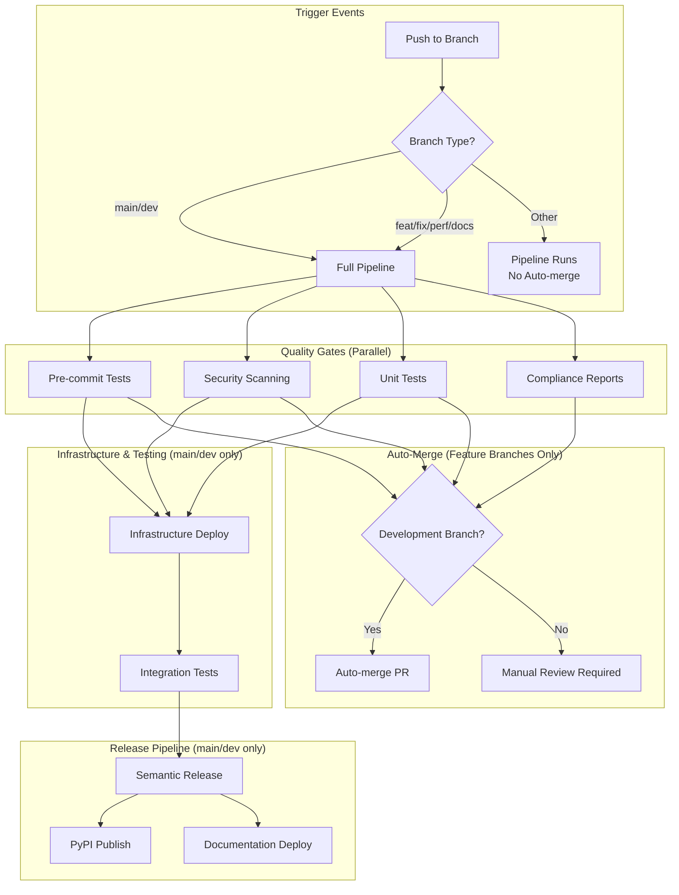
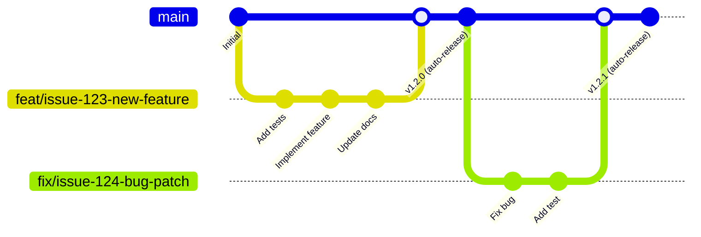
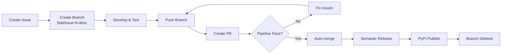
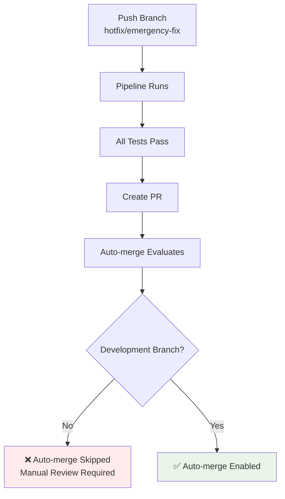
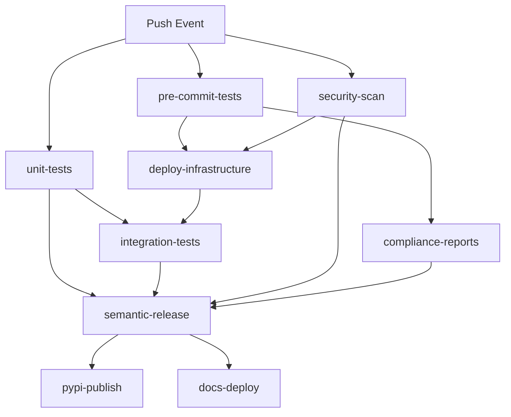
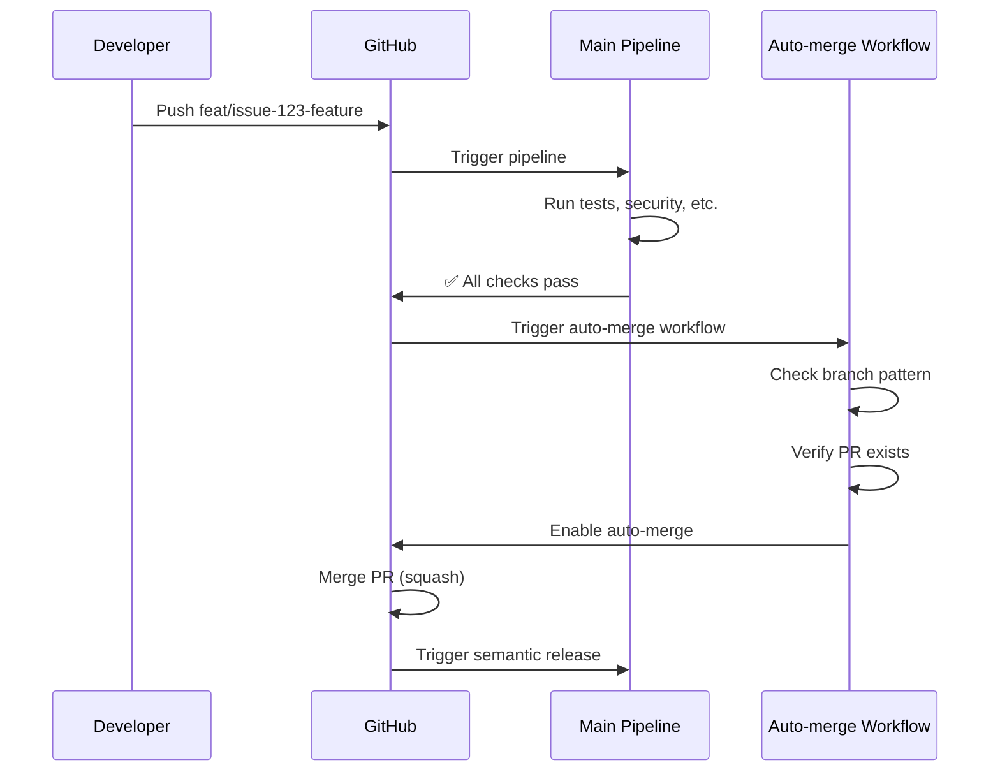
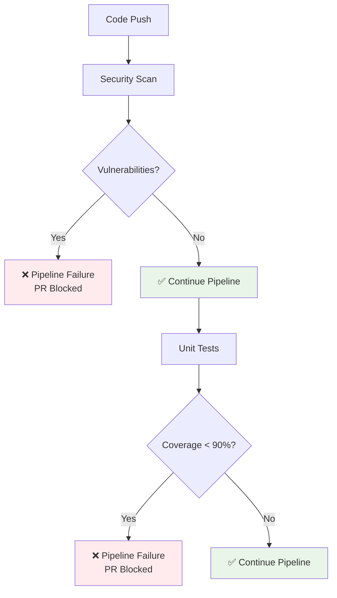
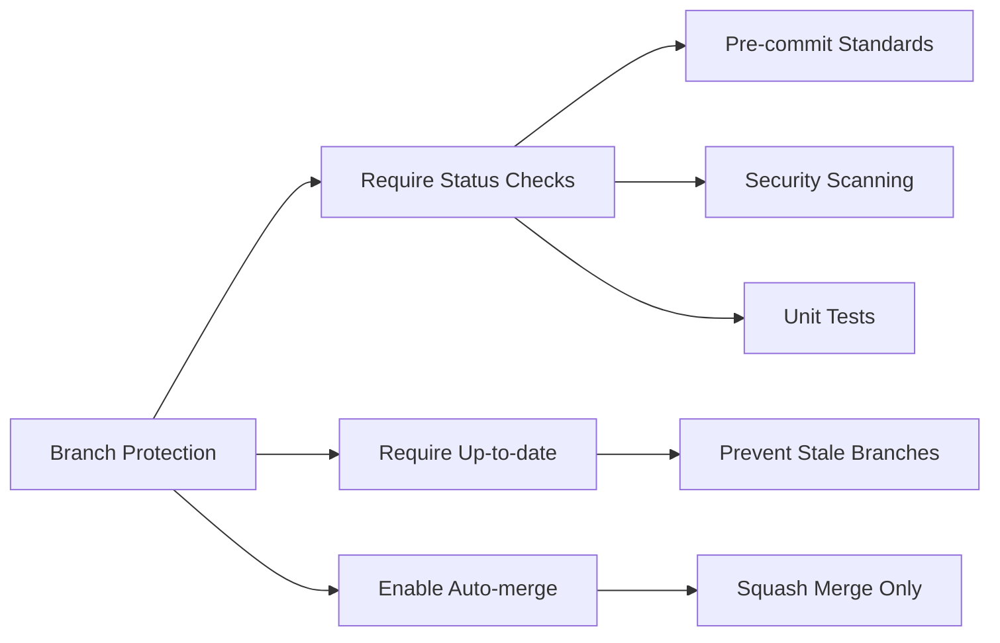

# DevOps Pipeline Guide

A comprehensive guide to the Augmenting Integrations DevOps pipeline, branch management, and development workflows.

## Table of Contents

- [Overview](#overview)
- [Pipeline Architecture](#pipeline-architecture)
- [Git Flow & Branch Strategy](#git-flow--branch-strategy)
- [Development Branch Types](#development-branch-types)
- [Pipeline Execution Flow](#pipeline-execution-flow)
- [Auto-Merge System](#auto-merge-system)
- [Security & Quality Gates](#security--quality-gates)
- [Branch Protection Rules](#branch-protection-rules)
- [Common Workflows](#common-workflows)
- [Troubleshooting](#troubleshooting)

## Overview

The Augmenting Integrations DevOps pipeline is designed for **continuous delivery** with a focus on:

- **Simplicity**: Single workflow, minimal complexity
- **Speed**: Parallel job execution, smart caching
- **Quality**: Comprehensive testing and security scanning
- **Automation**: Auto-merge for development branches
- **Reliability**: Concurrency control and race condition prevention

### Key Features

✅ **Push-only triggers** - No duplicate runs from PR events  
✅ **Concurrency control** - Prevents race conditions  
✅ **Development branch auto-merge** - `feat/*`, `fix/*`, `perf/*`, `docs/*`  
✅ **Manual review fallback** - Non-development branches require manual merge  
✅ **Comprehensive security scanning** - 4 security tools with failure enforcement  
✅ **Semantic versioning** - Automatic version bumps and PyPI publishing  
✅ **Clean commit history** - Squash merge strategy  

## Pipeline Architecture



### Pipeline Jobs Overview

| Job | Purpose | Runs On | Duration |
|-----|---------|---------|----------|
| **pre-commit-tests** | Code style, linting, formatting | All branches | ~30s |
| **security-scan** | 4 security tools (bandit, safety, pip-audit, semgrep) | All branches | ~45s |
| **unit-tests** | Fast unit tests with 90% coverage requirement | All branches | ~1m |
| **deploy-infrastructure** | AWS SAM deployment for testing | main/dev only | ~2m |
| **integration-tests** | Tests against deployed infrastructure | main/dev only | ~3m |
| **compliance-reports** | License compatibility checking | All branches | ~30s |
| **semantic-release** | Version bumping and changelog | main/dev only | ~15s |
| **pypi-publish** | Package publishing | main/dev only | ~30s |
| **docs-deploy** | GitHub Pages documentation | main only | ~45s |

## Git Flow & Branch Strategy

### Continuous Delivery Model

Our git flow follows a **continuous delivery** approach optimized for libraries:



### Branch Lifecycle



## Development Branch Types

### Primary Development Branches

Development branches follow the naming convention: `{type}/issue-{number}-{description}`

| Branch Type | Purpose | Example | Version Impact |
|-------------|---------|---------|----------------|
| **feat/** | New features | `feat/issue-45-user-auth` | Minor (1.2.0 → 1.3.0) |
| **fix/** | Bug fixes | `fix/issue-46-memory-leak` | Patch (1.2.0 → 1.2.1) |
| **perf/** | Performance improvements | `perf/issue-47-query-speed` | Patch (1.2.0 → 1.2.1) |
| **docs/** | Documentation updates | `docs/issue-48-api-guide` | Patch (1.2.0 → 1.2.1) |

### Special Branches

| Branch | Purpose | Auto-merge | Notes |
|--------|---------|------------|-------|
| **main** | Production releases | N/A | Protected, deploy to PyPI |
| **dev** | Staging (if used) | N/A | Deploy to TestPyPI |
| **dependabot/** | Dependency updates | Yes* | *Except major versions |

### Non-Development Branches

**What happens with non-development branches?**



**Result**: Pipeline runs normally, but auto-merge is skipped. These PRs require manual review and merge.

## Pipeline Execution Flow

### Trigger Mechanism

The pipeline uses **push events only** to eliminate duplicate runs:

```yaml
on:
  push:
    branches:
      - main
      - dev  
      - feat/*
      - fix/*
      - perf/*
      - docs/*
```

**Why no `pull_request` triggers?**
- PRs automatically show the status from the branch's last push
- Eliminates duplicate pipeline runs
- Reduces CI/CD minutes consumption
- Cleaner pipeline history

### Concurrency Control

```yaml
concurrency:
  group: ${{ github.workflow }}-${{ github.ref }}
  cancel-in-progress: true
```

**Benefits:**
- Prevents race conditions between concurrent runs
- Cancels older runs when new pushes occur
- Eliminates branch validation conflicts
- One pipeline run per branch at a time

### Job Dependencies



## Auto-Merge System

### Architecture

The auto-merge system runs as a separate workflow triggered after the main pipeline completes:



### Branch Pattern Matching

```javascript
// Auto-merge logic
const prefixes = 'feat|fix|perf|docs';
const prefixPattern = new RegExp(`^(${prefixes})/`);
const isFeatureBranch = prefixPattern.test(branch);
const isDependabot = pr.user.login === 'dependabot[bot]';

// Only auto-merge development branches and dependabot PRs
if (!isFeatureBranch && !isDependabot) {
  console.log('Skipping - branch requires manual review');
  return { skip: true };
}
```

### Auto-Merge Decision Matrix

| Branch Pattern | Dependabot | Auto-merge | Action |
|----------------|------------|------------|--------|
| `feat/issue-*` | No | ✅ Yes | Auto-merge after CI |
| `fix/issue-*` | No | ✅ Yes | Auto-merge after CI |
| `perf/issue-*` | No | ✅ Yes | Auto-merge after CI |
| `docs/issue-*` | No | ✅ Yes | Auto-merge after CI |
| `hotfix/*` | No | ❌ No | Manual review required |
| `release/*` | No | ❌ No | Manual review required |
| Any branch | Yes (minor/patch) | ✅ Yes | Auto-merge after CI |
| Any branch | Yes (major) | ❌ No | Manual review required |

## Security & Quality Gates

### Security Scanning Tools

The pipeline runs 4 security tools that **fail the pipeline** on findings:

| Tool | Purpose | Severity | Override Method |
|------|---------|----------|-----------------|
| **Bandit** | Python security linting | Medium/High (-ll flag) | `# nosec B123` |
| **Safety** | Dependency vulnerabilities | All | Pin versions with justification |
| **pip-audit** | Package vulnerabilities | All | Pin versions with justification |
| **Semgrep** | Static code analysis | All | `# nosemgrep: rule-id` |

### Quality Gates Enforcement



### Coverage Requirements

| Test Type | Coverage Requirement | Enforcement |
|-----------|---------------------|-------------|
| **Unit Tests** | 90% minimum | ❌ Fails pipeline |
| **Integration Tests** | Tracked, not enforced | ⚠️ Warning only |
| **Combined Coverage** | 90% for releases | ❌ Blocks release |

## Branch Protection Rules

### Required Status Checks

All development branches must pass these checks before merge:

```yaml
Required Status Checks:
  - "pre-commit-tests / Enforce commit standards"
  - "security-scan / Security scanning"  
  - "unit-tests / Run fast unit tests"
```

### Protection Configuration



### Repository Settings Required

**GitHub Repository → Settings → General → Pull Requests:**
- ✅ Allow auto-merge
- ✅ Allow squash merging  
- ❌ Allow merge commits (disabled)
- ❌ Allow rebase merging (disabled)

**GitHub Repository → Settings → Branches → Protection Rule for `main`:**
- ✅ Require status checks to pass before merging
- ✅ Require branches to be up to date before merging  
- ✅ Required status checks (exact job names)
- ✅ Dismiss stale PR reviews when new commits are pushed

## Common Workflows

### 1. Feature Development

```bash
# 1. Create issue on GitHub
gh issue create --title "Add user authentication" --body "..."

# 2. Create and switch to feature branch  
git checkout main
git pull origin main
git checkout -b feat/issue-45-user-auth

# 3. Develop with TDD
# Write failing test
# Implement minimal code
# Refactor

# 4. Push and create PR
git add .
git commit -m "feat: add user authentication system"
git push -u origin feat/issue-45-user-auth

# 5. Create PR (links to issue)
gh pr create --title "feat: add user authentication" \
  --body "Implements secure user authentication system. Closes #45"

# 6. Pipeline runs automatically
# 7. Auto-merge happens when all checks pass
# 8. Semantic release creates new version
# 9. PyPI publish happens automatically
```

### 2. Bug Fix Workflow

```bash
# 1. Create issue
gh issue create --title "Fix memory leak in data processor" --body "..."

# 2. Create fix branch
git checkout main  
git pull origin main
git checkout -b fix/issue-46-memory-leak

# 3. Fix bug with test
# Add test that reproduces bug
# Fix the bug
# Verify test passes

# 4. Submit fix
git add .
git commit -m "fix: resolve memory leak in data processor"  
git push -u origin fix/issue-46-memory-leak

# 5. Create PR
gh pr create --title "fix: resolve memory leak" \
  --body "Fixes memory leak in DataProcessor class. Closes #46"

# Auto-merge will handle the rest
```

### 3. Emergency Hotfix (Manual Review)

```bash
# 1. Create non-development branch
git checkout -b hotfix/critical-security-patch

# 2. Implement fix
git add .
git commit -m "hotfix: patch critical security vulnerability"
git push -u origin hotfix/critical-security-patch

# 3. Create PR
gh pr create --title "URGENT: Security patch" \
  --body "Critical security fix - requires immediate review"

# 4. Pipeline runs, but NO auto-merge
# 5. Manual review and merge required
# 6. Semantic release still works on merge to main
```

## Troubleshooting

### Common Issues

#### Pipeline Never Triggers
**Symptoms**: No pipeline run after push  
**Cause**: Branch doesn't match trigger patterns  
**Solution**: Ensure branch follows `feat/*`, `fix/*`, `perf/*`, `docs/*` pattern

#### Auto-merge Doesn't Work
**Symptoms**: PR created but no auto-merge enabled  
**Cause**: Either branch pattern doesn't match or repository settings  
**Solution**:
1. Check branch naming: `feat/issue-123-description`
2. Verify repository auto-merge setting enabled
3. Confirm all required status checks pass

#### Security Gate Failures
**Symptoms**: Pipeline fails on security scan  
**Cause**: Vulnerability detected or false positive  
**Solution**:
```python
# For false positives, use appropriate override:
password = get_env('PASSWORD')  # nosec B105: env var is secure source
```

#### Coverage Failures  
**Symptoms**: Unit tests fail with coverage error  
**Cause**: Test coverage below 90%  
**Solution**: Add tests or exclude non-testable code:
```python
if TYPE_CHECKING:  # pragma: no cover
    from typing import SomeType
```

#### Branch Behind Main
**Symptoms**: Auto-merge fails with "branch not up to date"  
**Cause**: Branch diverged from main  
**Solution**:
```bash
git fetch origin main
git rebase origin/main  
git push --force-with-lease
```

### Pipeline Performance

| Stage | Typical Duration | Parallel Jobs |
|-------|------------------|---------------|
| **Quality Gates** | 30-45 seconds | 3 jobs parallel |
| **Infrastructure** | 2-3 minutes | After quality gates |
| **Integration Tests** | 2-4 minutes | After infrastructure |
| **Release & Publish** | 30-60 seconds | After tests pass |
| **Total (main/dev)** | 5-8 minutes | End-to-end |
| **Total (feature branch)** | 2-3 minutes | No infrastructure |

### Success Metrics

✅ **No duplicate pipeline runs** - Single run per push  
✅ **No race conditions** - Concurrency control prevents conflicts  
✅ **90%+ auto-merge rate** - Development branches merge automatically  
✅ **< 5 minute feedback** - Fast feedback for feature branches  
✅ **Zero security vulnerabilities** - All findings block merge  
✅ **Clean git history** - Squash merge creates linear history  

---

## Summary

The Augmenting Integrations DevOps pipeline balances automation with safety:

- **Development branches** (`feat/*`, `fix/*`, `perf/*`, `docs/*`) get full automation
- **Non-development branches** get pipeline validation but require manual review
- **Quality gates** ensure security and reliability without slowing development  
- **Auto-merge** reduces toil while maintaining code quality
- **Semantic versioning** automates releases and PyPI publishing

This approach provides fast feedback for routine development while ensuring proper oversight for exceptional cases.
