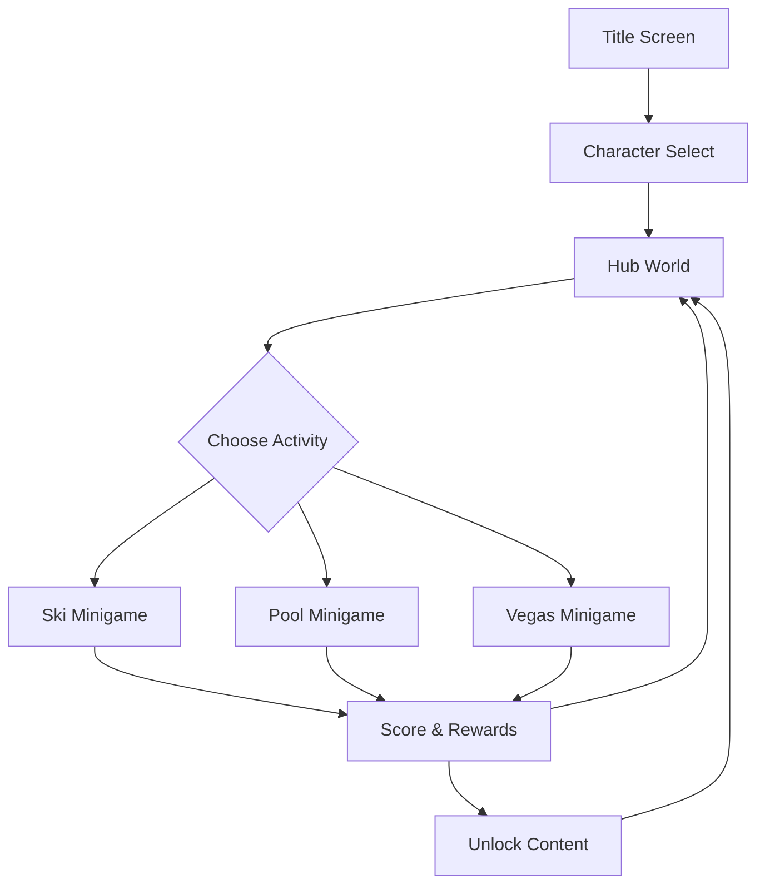
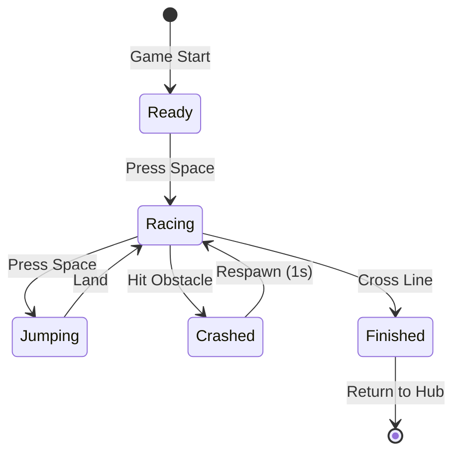
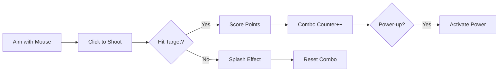
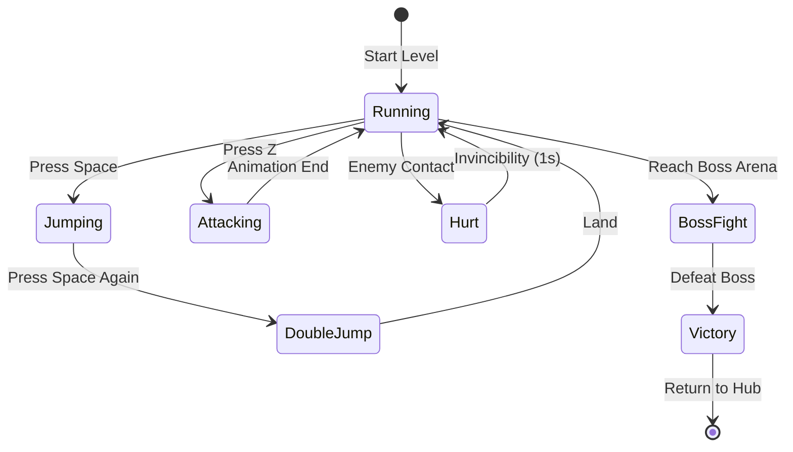
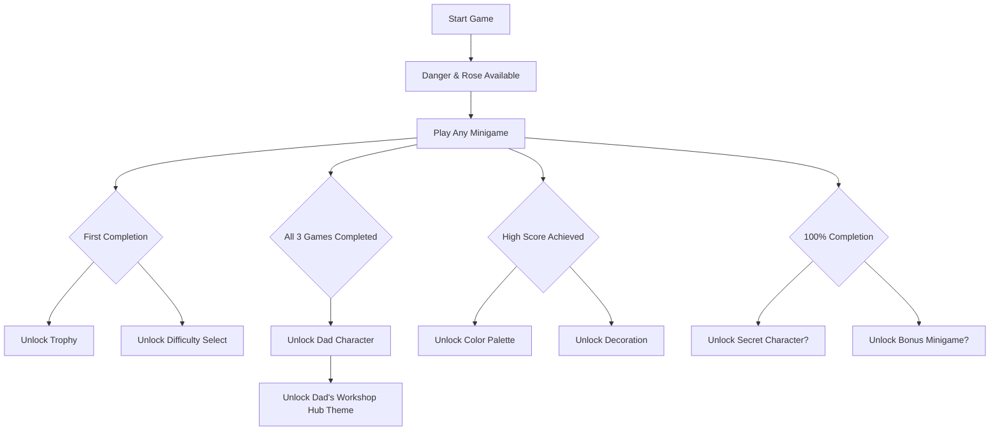

# 🎮 Danger Rose - Game Design Document

## Table of Contents
1. [Game Overview](#game-overview)
2. [Core Gameplay Loop](#core-gameplay-loop)
3. [Character System](#character-system)
4. [Hub World Design](#hub-world-design)
5. [Minigame Mechanics](#minigame-mechanics)
6. [Progression & Unlockables](#progression--unlockables)
7. [Scoring & Leaderboards](#scoring--leaderboards)
8. [Co-op Mechanics](#co-op-mechanics)
9. [Visual Design](#visual-design)
10. [Audio Design](#audio-design)

## Game Overview

**Danger Rose** is a family-friendly collection of minigames tied together by a cozy apartment hub world. The game emphasizes:
- **Family Bonding**: Activities framed as family time with Dad
- **Accessibility**: Simple controls suitable for ages 8+
- **Progression**: Unlockable content encourages replayability
- **Education**: Subtly teaches programming concepts through gameplay

### Core Pillars
1. **Fun First**: Every mechanic should be immediately enjoyable
2. **Family Together**: Co-op enhances, never required
3. **Learn by Playing**: Programming concepts through gameplay
4. **Celebration**: Frequent positive feedback and rewards

## Core Gameplay Loop



### Session Flow (15-30 minutes)
1. **Select Character** (30 seconds)
2. **Explore Hub** (1-2 minutes)
3. **Play Minigame** (1-2 minutes per round)
4. **View Scores** (30 seconds)
5. **Unlock Rewards** (varies)
6. **Repeat or Switch Games**

## Character System

### Playable Characters

#### Danger (Yasha)
- **Age**: 10 years old
- **Personality**: Adventurous, competitive
- **Special Ability**: Double Jump (Ski game)
- **Favorite Game**: Vegas Dash
- **Unlock Requirement**: Available from start

#### Rose (Ellie)
- **Age**: 8 years old
- **Personality**: Creative, thoughtful
- **Special Ability**: Precision Aim (Pool game)
- **Favorite Game**: Pool Splash
- **Unlock Requirement**: Available from start

#### Dad
- **Personality**: Supportive, secretly competitive
- **Special Ability**: Power Mode (all games)
- **Favorite Game**: Ski Downhill
- **Unlock Requirement**: Complete all 3 minigames with any character

### Character Stats
```yaml
Base Stats:
  - Movement Speed: 5.0 units/second
  - Jump Height: 128 pixels
  - Attack Range: 64 pixels

Character Modifiers:
  Danger:
    - Movement Speed: +10%
    - Jump Height: +20%
  Rose:
    - Aim Accuracy: +15%
    - Power-up Duration: +25%
  Dad:
    - All Stats: +5%
    - Score Multiplier: 1.2x
```

## Hub World Design

### Layout
```
┌─────────────────────────────────────┐
│  Trophy      Window (Pool View)     │
│  Shelf                              │
│                                     │
│  ┌───┐      Couch &       ┌───┐   │
│  │Ski│       TV           │Pool│   │
│  └───┘                    └───┘    │
│                                     │
│         [Player Spawn]              │
│                                     │
│              ┌─────┐                │
│              │Vegas│                │
│              └─────┘                │
└─────────────────────────────────────┘
```

### Interactive Elements

#### Trophy Shelf
- Displays high score trophies
- Shows completion medals
- Unlocked decorations appear here
- Clicking shows detailed stats

#### Save Point (Couch)
- Auto-saves when sitting
- Shows last save time
- Quick access to settings

#### Minigame Doors
- **Visual States**:
  - Locked: Grayed out with lock icon
  - Available: Glowing outline
  - New High Score: Sparkle effects
  - 100% Complete: Gold frame

#### Window View
- Dynamic based on time played
- Shows other family members in pool
- Weather changes with seasons
- Easter eggs during holidays

## Minigame Mechanics

### 🎿 Ski Downhill

#### Core Mechanics


#### Gameplay Elements
- **Movement**: Left/Right arrows for steering
- **Jump Mechanic**:
  - Hold Space to charge (max 1 second)
  - Release for variable height jump
  - Can jump over small obstacles
- **Dad AI**:
  ```python
  # Rubber-band AI keeps Dad near player
  if distance_to_player > 200:
      dad_speed = base_speed * 1.5
  elif distance_to_player < 50:
      dad_speed = base_speed * 0.8
  else:
      dad_speed = base_speed
  ```

#### Obstacles & Collectibles
| Element | Behavior | Points | Effect |
|---------|----------|--------|--------|
| Tree | Static obstacle | -1 life | Crash animation |
| Rock | Static obstacle | -1 life | Stumble animation |
| Snowflake | Floating collectible | +10 | Sparkle effect |
| Speed Boost | Rare pickup | +0 | 2x speed for 3s |
| Shield | Very rare | +0 | 1-hit protection |

#### Difficulty Scaling
- **Easy**: 20 obstacles/minute, wide gaps
- **Normal**: 40 obstacles/minute, normal gaps
- **Hard**: 60 obstacles/minute, narrow gaps
- **Endless**: Increases every 30 seconds

### 🏊 Pool Splash

#### Core Mechanics


#### Target System
- **Target Types**:
  1. **Duck** (Yellow): Slow, straight line, 50 points
  2. **Beach Ball** (Multi-color): Bounces, 75 points
  3. **Inflatable Donut** (Pink): Circles pool, 100 points
  4. **Golden Fish** (Rare): Fast zigzag, 250 points

#### Power-Up System
| Power-Up | Duration | Effect | Spawn Rate |
|----------|----------|--------|------------|
| Triple Shot | 10s | Shoot 3 balloons | 15% |
| Rapid Fire | 8s | No reload time | 10% |
| Homing Shot | 5s | Auto-aim assist | 5% |
| Mega Balloon | 1 shot | Huge splash radius | 8% |

#### Combo System
```
Combo Multiplier = min(consecutive_hits, 10)
Points = base_points * (1 + combo_multiplier * 0.1)
```

### 🎰 Vegas Dash

#### Core Mechanics


#### Enemy Types
1. **Slot Machine Walker**
   - HP: 1
   - Movement: Left/right patrol
   - Attack: Contact damage
   - Defeat: Sword or rainbow

2. **Flying Dice**
   - HP: 1
   - Movement: Sine wave pattern
   - Attack: Dive bomb
   - Defeat: Rainbow only

3. **Card Soldier**
   - HP: 2
   - Movement: Charges at player
   - Attack: Card throw
   - Defeat: Dodge then attack

#### Boss: Vegas Sphere
```yaml
Phase 1 - Happy Face 😊:
  - HP: 10
  - Attacks:
    - Coin shower (avoid)
    - Laser sweep (jump over)
  - Pattern: Predictable 3-attack loop

Phase 2 - Angry Face 😠:
  - HP: 15
  - Attacks:
    - All Phase 1 attacks
    - Shockwave stomp (double jump)
    - Homing cards (destroy with sword)
  - Pattern: Random with tells

Phase 3 - Dizzy Face 😵:
  - HP: 20
  - Attacks:
    - All previous attacks
    - Screen rotation
    - Slot machine spawn
  - Pattern: Chaotic, multiple simultaneous
```

#### Collectibles
- **Casino Chips**: 100 points each
- **Health (Nachos)**: Restore 1 HP
- **Health (Soda)**: Restore full HP
- **Temporary Power-ups**:
  - Super Sword: One-hit kills for 10s
  - Rainbow Rapid: No cooldown for 8s
  - Invincibility Star: 5 seconds

## Progression & Unlockables

### Unlock Tree


### Unlockable Content

#### Characters
- **Dad**: Complete all 3 minigames
- **Mystery Character**: 100% completion (future update)

#### Hub Decorations
1. **Ski Trophy**: Beat normal difficulty
2. **Pool Float**: 5000+ points in Pool
3. **Neon Sign**: Defeat Vegas boss
4. **Family Photo**: Unlock Dad
5. **Disco Ball**: All gold medals
6. **Arcade Cabinet**: 50,000 total points

#### Character Customization
- **Color Palettes** (per character):
  - Classic (default)
  - Neon (high scores)
  - Pastel (perfect runs)
  - Shadow (hard mode completion)
  - Rainbow (100% completion)

#### Difficulty Modes
- **Easy**: Unlocked by default
- **Normal**: Complete any game on Easy
- **Hard**: Complete all games on Normal
- **Endless**: Complete any game on Hard

## Scoring & Leaderboards

### Score Calculation

#### Base Scoring Formula
```python
final_score = (
    base_points +
    time_bonus +
    (combo_points * difficulty_multiplier) +
    perfect_bonus
) * character_multiplier
```

#### Difficulty Multipliers
- Easy: 0.5x
- Normal: 1.0x
- Hard: 2.0x
- Endless: 3.0x + 0.1x per minute

### Leaderboard Categories
1. **Overall High Score** (all games combined)
2. **Per-Game High Score**
3. **Character-Specific Records**
4. **Family Leaderboard** (all players)
5. **Daily/Weekly Challenges** (future)

### Score Persistence
```json
{
  "player_name": "Danger",
  "scores": {
    "ski": {
      "easy": 1250,
      "normal": 3400,
      "hard": 5600,
      "endless": 12000
    },
    "pool": {
      "easy": 2000,
      "normal": 5500,
      "hard": 8900
    },
    "vegas": {
      "easy": 3000,
      "normal": 7200,
      "hard": 15000
    }
  },
  "total_points": 58850,
  "unlocks": ["dad", "neon_palette", "ski_trophy"],
  "achievements": ["first_win", "perfect_ski", "vegas_boss_no_hit"]
}
```

## Co-op Mechanics

### Implementation Strategy
Co-op is designed to be:
- **Drop-in/Drop-out**: Join anytime
- **Asymmetric**: Different roles possible
- **Collaborative**: Shared score/lives
- **Non-competitive**: No friendly fire

### Per-Game Co-op

#### Ski Co-op
- Both players on screen
- Shared snowflake collection
- Team combo for synchronized jumps
- Resurrection: Fallen player respawns at partner

#### Pool Co-op
- Split targeting zones
- Combo extends across players
- Special dual-shot power-up
- Cooperative target challenges

#### Vegas Co-op
- Shared health pool
- One sword, one rainbow specialist
- Team attacks do bonus damage
- Boss fight coordination required

### Co-op Exclusive Features
1. **Team Combos**: Synchronized actions = bonus points
2. **Resurrection**: Help fallen teammates
3. **Shared Power-ups**: Benefits both players
4. **Co-op Achievements**: "Perfect Harmony", "Team Carry"

## Visual Design

### Art Direction
- **Style**: Colorful, cartoonish, kid-friendly
- **Inspiration**: Nintend* family games, Pixar aesthetics
- **Color Palette**: Bright, high contrast, accessibility-friendly

### Sprite Specifications
```yaml
Characters:
  - Base Size: 128x128 pixels
  - Animation Frames:
    - Idle: 4 frames
    - Walk: 8 frames
    - Jump: 3 frames
    - Attack: 6 frames
    - Hurt: 2 frames
    - Victory: 8 frames

Environments:
  - Tile Size: 64x64 pixels
  - Backgrounds: 1920x1080 (scalable)
  - UI Elements: 9-slice scalable

Effects:
  - Particles: 16x16 base
  - Explosions: 64x64 sprite sheet
  - Trails: Procedural generation
```

### Visual Feedback Systems
1. **Hit Effects**: Screen shake, particle burst
2. **Collection**: Item magnetism, sparkle trail
3. **Combo**: Growing visual aura
4. **Power-ups**: Character glow, UI indicators
5. **Achievements**: Fireworks, confetti

## Audio Design

### Music Themes
| Scene | Style | Tempo | Mood |
|-------|-------|-------|------|
| Title | Cheerful | 120 BPM | Welcoming |
| Hub | Cozy | 80 BPM | Relaxed |
| Ski | Energetic | 140 BPM | Exciting |
| Pool | Tropical | 100 BPM | Fun |
| Vegas | Electronic | 128 BPM | Intense |

### Sound Effects Categories
1. **UI Sounds**
   - Menu navigation
   - Selection confirm
   - Achievement unlock

2. **Character Sounds**
   - Footsteps (surface-dependent)
   - Jump/land
   - Attack swoosh
   - Hurt/victory vocals

3. **Game-Specific**
   - Ski: Swoosh, crash, snowflake collect
   - Pool: Splash, balloon pop, target hit
   - Vegas: Coin collect, slot machine, boss roar

### Audio Implementation
```python
# Dynamic music system
if player_health < 30%:
    music.add_tension_layer()
elif combo > 10:
    music.add_excitement_layer()

# Adaptive SFX
splash_volume = min(1.0, target_distance / 500)
play_sfx("splash", volume=splash_volume)
```

## Future Expansion Ideas

### Potential New Minigames
1. **Kitchen Chaos**: Cooking time management
2. **Garage Band**: Rhythm game
3. **Garden Guardian**: Tower defense
4. **Toy Box Rumble**: Fighting game

### Seasonal Events
- **Winter**: Special ski challenges
- **Summer**: Pool party modes
- **Halloween**: Spooky Vegas theme
- **Holidays**: Gift collection mode

### Online Features (Phase 2)
- Global leaderboards
- Ghost recordings
- Level sharing
- Family tournaments

---

*This document is a living guide that will evolve with playtesting and family feedback!*
